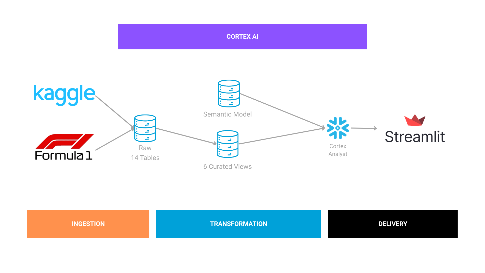

# 🏎️ Formula 1 AI Analyst

Formula 1 AI Analyst is a portfolio project demonstrating how to build a
natural language analytics application using Snowflake Cortex Analyst, a
curated semantic model, and Streamlit.

Users ask questions about historical Formula 1 data in plain English.
Cortex Analyst converts the request into SQL, Snowflake executes the
query, and Streamlit presents the results.

------------------------------------------------------------------------

## 🎬 Demo

> Demo GIF placeholder

```md

```

------------------------------------------------------------------------

## 🏗️ Architecture



```text
Kaggle Dataset
      │
      ▼
Snowflake RAW Tables
      │
      ▼
Analytics Views
      │
      ▼
Semantic Model
      │
      ▼
Cortex Analyst
      │
      ▼
Streamlit
```

------------------------------------------------------------------------

## ✨ Key Features

- 💬 Natural language → SQL with Cortex Analyst
- 🧠 Curated semantic model for business-friendly queries
- ❄️ Analytics views built with Snowflake SQL
- 📊 Interactive Streamlit interface
- 🚀 Streamlit in Snowflake deployment

------------------------------------------------------------------------

## 📁 Repository Structure

```text
app/                Streamlit application
sql/                DDL and analytics views
semantic_models/    Cortex Analyst semantic model
docs/               Documentation and assets
tests/              Unit tests
```

------------------------------------------------------------------------

## 🛠️ Technology Stack

| Category | Technologies |
| --- | --- |
| 🐍 Language | Python 3.11 |
| ❄️ Data Warehouse | Snowflake |
| 🤖 AI | Cortex Analyst |
| 🎈 Framework | Streamlit |
| 🗄️ Database | Snowflake SQL |
| 📦 Libraries | pandas, Snowpark, Snowflake Connector |
| ✅ Testing | pytest |

------------------------------------------------------------------------

## 🗂️ Data Source

This project uses the **Formula 1 World Championship (1950-2024)**
dataset by **Rohan Rao**, available on Kaggle.

https://www.kaggle.com/datasets/rohanrao/formula-1-world-championship-1950-2020

------------------------------------------------------------------------

## 🚀 Deployment

This project is designed to run inside Snowflake using Streamlit in
Snowflake. The Snowflake-native app entrypoint is:

```text
app/sis_streamlit_app.py
```

Deployment uses the Snowflake CLI project definition:

```text
snowflake.yml
environment.yml
```

The deployment flow is:

1. Create the Snowflake database, schemas, raw tables, analytics views,
   and semantic model stage using the SQL files in `sql/`.
2. Load the Kaggle Formula 1 source data into the Snowflake `RAW` schema.
3. Upload `semantic_models/f1_analyst.yaml` to the semantic model stage.
4. Deploy the Streamlit app with Snowflake CLI.

Full deployment notes are available in
`docs/deploy_streamlit_in_snowflake.md`.

------------------------------------------------------------------------

## 🔮 Future Improvements

- 💬 Chat history
- ⚡ Query caching
- 🔁 Multi-turn conversations
- 📈 Visualization support
- 🧩 Semantic model expansion

------------------------------------------------------------------------

## 📌 About

This project showcases production-style analytics with Snowflake, Cortex
Analyst, semantic modeling, SQL engineering, and Streamlit application
development.
